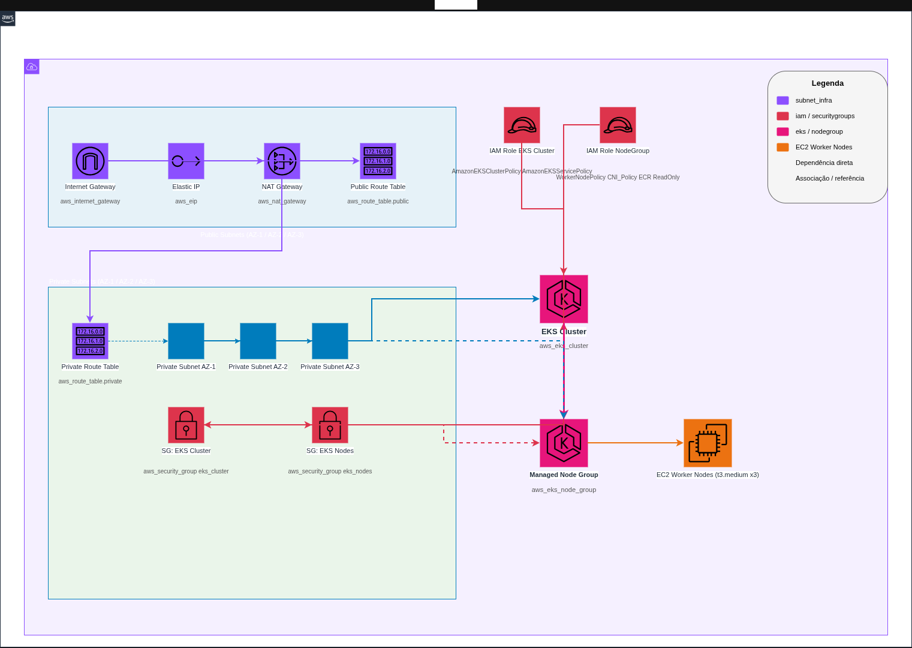

# infra-cluster
Criação de um cluster Kubernetes na AWS (EKS) usando o modelo de __node groups gerenciados__ e com o novo padrão de acesso de _Access Entry_.

Esse código está criando também a estrutura de VPC, subredes públicas e privadas, além de NAT Gateway, Elastic IP, Internet Gateway e uma tabela de rotas.

## Descrição breve
O projeto criado é a implantação de uma infraestrutura comleta de cluster kubernetes na Nuvem AWS de forma modularizada, contendo os seguintes módulos:
  * eks
    * Módulo que faz a criação efetiva do cluster, por padrão utiliza a versão 1.33, mas pode-se alterar através do arquivo de variáveis. (_ver arquivo terraform.tfvars.sample para detalhes_.)
  * iam
    * Faz a criação das roles IAM necessárias para o funcionamento do fluxo, tanto para cluster quanto para node groups
  * nodegroup
    * Cria o Node Group dentro do cluster criado pelo módulo referido acima
  * securitygroups
    * Faz a criação das regras de segurança necessárias para comunicação de rede entre Control Plane e Worker Nodes, além de configuração de regra de liberação de tráfego entre os nodes.
  * subnet_infra
    * Módulo completamente opcional; deve ser habilitado caso você não possua uma estrutura de rede criada e corretamente configurada (como era o meu caso.)

Todos os módulos acima permitem a habilitação ou não através do arquivo de variáveis. Caso algum módulo não seja ativado, é necessário que se informe seus valores.

---
### Desenho da arquitetura criada pelo terraform

